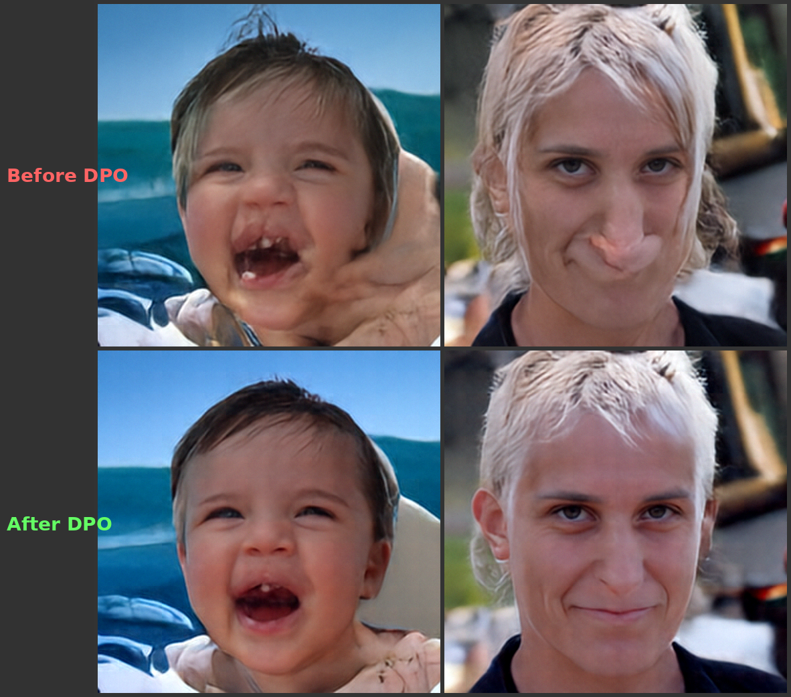
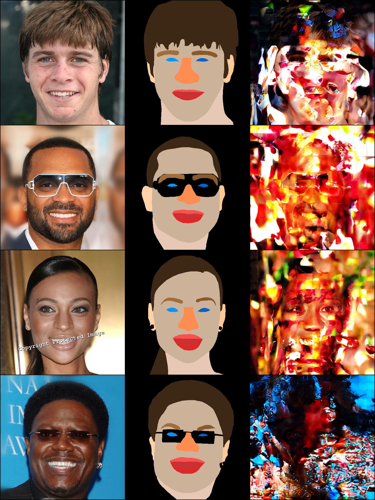
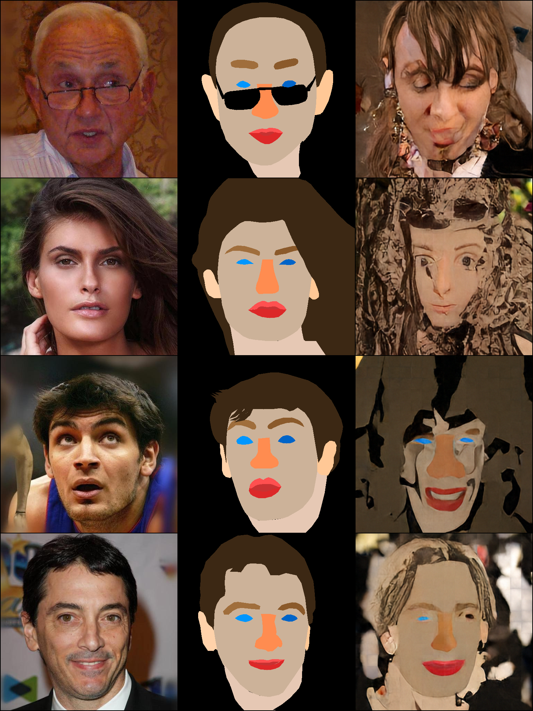
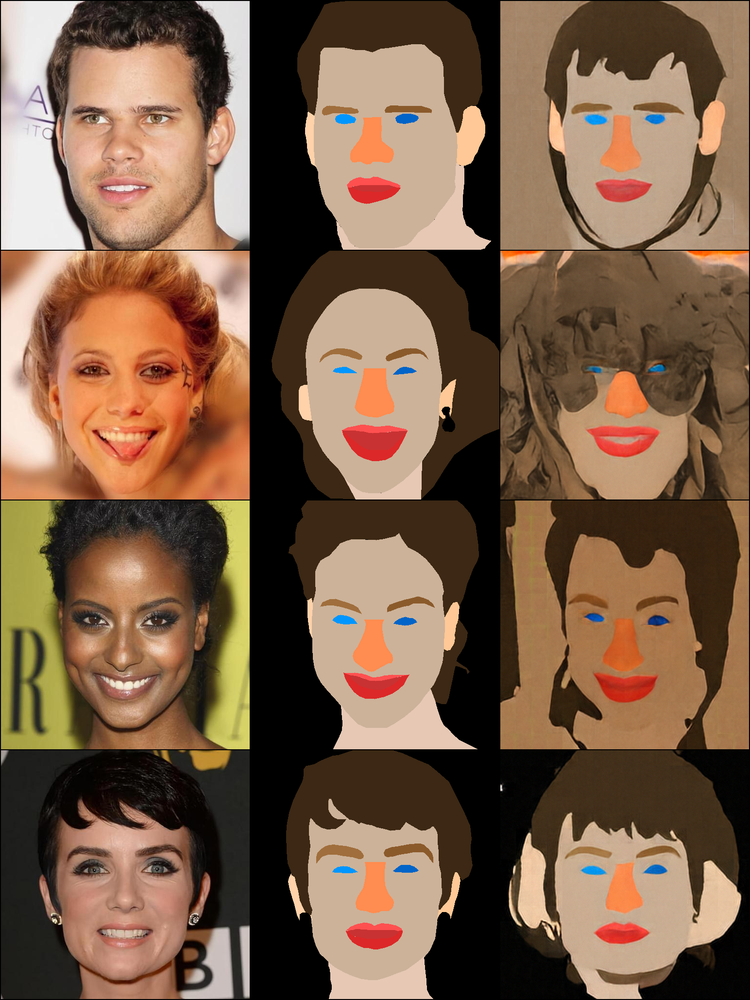
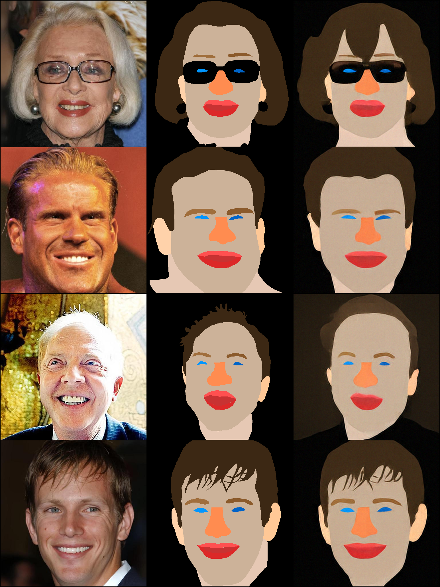
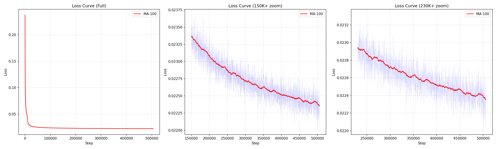
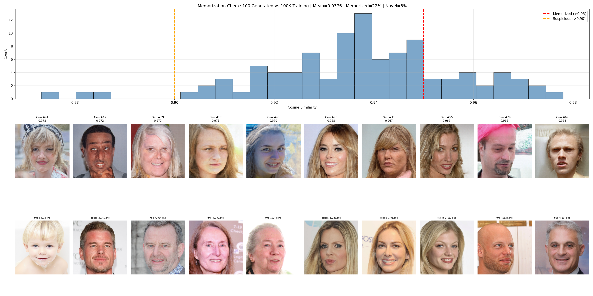

# PatchDiffusionDiT: Pixel-Space Flow Matching with DPO and Multi-Task Segmentation

A 130M-parameter pixel-space Diffusion Transformer trained from scratch on FFHQ + CelebA-HQ (100K face images, 512x512).
After pre-training, the model is aligned with human preferences via **Diffusion-DPO** (adapted for Flow Matching), and extended to **semantic segmentation** through multi-task continued pre-training with only 104 annotated images.

## Key Results

### Face Generation (Flow Matching, Heun Sampler)

<p align="center">

</p>

### DPO Improves Broken Generations

Same seeds, before and after applying Diffusion-DPO with 500 human-evaluated preference pairs:

<p align="center">

</p>

### Semantic Segmentation with Only 104 Training Images

All images below are **unseen** (not in the 104-image training set):

<p align="center">

</p>

### Segmentation Quality Progression (0 / 6K / 12K / 50K steps)

<p align="center">




</p>

## Architecture

| Parameter | Value |
|-----------|-------|
| Model | PatchDiffusionDiT |
| Parameters | ~130M |
| Image size | 512 x 512 (pixel space) |
| Patch size | 32 |
| Hidden dim | 768 |
| Depth | 12 layers |
| Heads | 12 |
| Bottleneck dim | 128 |
| Position encoding | 2D RoPE |
| FFN | SwiGLU |
| Normalization | RMSNorm + AdaLN-Zero |
| Prediction type | x-prediction with v-loss |
| Sampler | Heun (2nd-order ODE) |

### Multi-Task Design

The model supports both unconditional face generation and conditional segmentation through:

- **`task_emb`**: Learned task embedding (0 = face generation, 1 = segmentation), added to the timestep embedding via AdaLN
- **`modality_emb`**: Learned modality embedding (0 = condition tokens, 1 = denoising target), added to patch tokens
- For segmentation: image tokens and noisy mask tokens are concatenated and processed together via self-attention (MMDiT-style), with shared 2D RoPE positions ensuring spatial correspondence

Both embeddings are zero-initialized for backward compatibility with pre-trained checkpoints.

## Three-Stage Pipeline

### Stage 1: Pre-Training (Flow Matching)

- **Data**: FFHQ (70K) + CelebA-HQ (30K) = 100K face images at 512x512
- **Method**: Flow Matching with Rectified Flow, v-loss, logit-normal timestep sampling
- **Patch Diffusion**: 50% probability of training on half-resolution random crops (256x256)
- **Training**: 530K steps, batch size 128, lr=1e-4, AdamW 8-bit, BF16 + torch.compile
- **Hardware**: RTX 6000 Ada 48GB (~122 img/s)

<p align="center">

</p>

**Finding**: Loss continued to decrease after 400K steps (0.0225 -> 0.0224), but **generation quality did not visibly improve**. The model was spending compute on imperceptible high-frequency details. This motivated DPO as a more efficient path to quality improvement.

### Stage 2: Diffusion-DPO (Preference Alignment)

We adapted [Diffusion-DPO](https://arxiv.org/abs/2311.12908) (Wallace et al., 2023) from DDPM noise-prediction to Flow Matching v-prediction:

**Original (DDPM)**:
```
L = -log sigma(-beta * T * (||eps_w - eps_theta||^2 - ||eps_w - eps_ref||^2
                           - (||eps_l - eps_theta||^2 - ||eps_l - eps_ref||^2)))
```

**Ours (Flow Matching)**:
```
L = -log sigma(-beta * (||v_w - v_theta||^2 - ||v_w - v_ref||^2
                       - (||v_l - v_theta||^2 - ||v_l - v_ref||^2)))
```

Key differences:
- Replace noise-prediction MSE with velocity-prediction MSE
- Remove the T factor (continuous time, no discrete step count)
- Forward process: `z_t = t * x_0 + (1-t) * eps` instead of DDPM schedule

**DPO Training Details**:
- 500 human-evaluated pairwise preferences via browser-based A/B comparison UI
- beta=1000, lr=1e-6, 50 epochs
- Reference model: frozen copy of the pre-trained base

**Automated DPO Pipeline** (`auto_dpo.py`):
We also built a fully automated iterative DPO pipeline using DINOv2 features:
1. Generate 10K images from the current model
2. Score each image by K-NN cosine similarity to FFHQ features (DINOv2 ViT-B/14)
3. Construct 5K preference pairs (top 30% vs bottom 30%)
4. Train DPO
5. Repeat with updated model as reference

**Hyperparameter sensitivity**:
| beta | lr | Result |
|------|----|--------|
| 5000 | 1e-6 | Too conservative, no visible change |
| 1000 | 1e-6 | Good balance, subtle but measurable improvement |
| 100 | 1e-6 | Collapsed (colors broken, faces distorted) |
| 5000 | 1e-7 | Stable with automated 5K pairs |

### Stage 3: Multi-Task Segmentation

Semantic segmentation is cast as a **conditional image generation task**: given a face image, generate the corresponding RGB segmentation mask through the denoising process.

- **Data**: CelebAMask-HQ, using only **104 images** (10% of available annotations)
- **15 classes**: background, skin, nose, left/right eye, left/right brow, left/right ear, mouth, upper/lower lip, hair, neck
- **Training**: 50K steps, seg_ratio=0.1 (10% of steps are segmentation, 90% face generation)
- **Conditioning**: Image patches serve as condition tokens (no noise), mask patches are denoised. Both share the same RoPE positions for spatial alignment.

**Why 104 images is enough**: The model already understands face structure from 530K steps of generation training. Segmentation only needs to learn the color-coding mapping, not face anatomy.

**Segmentation DPO**: We further improved segmentation quality with 2 rounds of DPO using 100 human-evaluated mask preference pairs each.

## Memorization Analysis

We verified the model generates novel faces rather than memorizing training data:

<p align="center">

</p>

Mean cosine similarity to nearest training image: 0.937 (pixel space at 256x256). Visual inspection confirmed all generated faces are distinct individuals. High similarity is expected for face datasets due to shared structural properties.

## Usage

### Requirements

```bash
pip install torch torchvision Pillow numpy tensorboard flask
# Optional: bitsandbytes (8-bit optimizer), liger-kernel (fused RMSNorm)
```

### Pre-Training

```bash
python train.py \
    --data_dir ./images256_ffhq_celebahq \
    --batch_size 128 --lr 1e-4 \
    --compile --max_autotune --optim_8bit --liger --preload \
    --bottleneck_dim 128 --img_size 512 --patch_size 32 \
    --total_steps 400000
```

### DPO Fine-Tuning

```bash
# 1. Generate images for evaluation
python generate_for_eval.py --ckpt runs/.../ckpt_final.pt --n 500

# 2. Human evaluation via web UI
python evaluate_web.py --img_dir dpo_data/generated --out dpo_data/pairs.json --n 500
# Open http://localhost:8501, click preferred image or use arrow keys

# 3. Train DPO
python train_dpo.py \
    --ckpt runs/.../ckpt_final.pt \
    --pairs dpo_data/pairs.json \
    --img_dir dpo_data/generated \
    --beta 1000 --lr 1e-6 --epochs 50
```

### Automated DPO (DINO-based)

```bash
# Precompute FFHQ features (one-time, ~10 min)
python dino_scorer.py --precompute --data_dir ./images256_ffhq_celebahq

# Run iterative auto-DPO
python auto_dpo.py \
    --base_ckpt runs/.../ckpt_final.pt \
    --n_rounds 5 --n_generate 10000 --n_pairs 5000 --beta 5000
```

### Multi-Task Segmentation

```bash
python train_multitask.py \
    --ckpt runs/.../dpo_epoch_0030.pt \
    --face_dir ./images256_ffhq_celebahq \
    --seg_dir ./celebamask_hq_15class \
    --seg_fraction 0.1 --seg_ratio 0.1 \
    --batch_size 64 --lr 1e-5 --total_steps 50000 --compile
```

### Generate Denoising Video

```bash
python make_denoise_video.py --ckpt runs/.../ckpt_final.pt --out denoise.mp4
```

## Project Structure

```
model.py                 # PatchDiffusionDiT architecture
train.py                 # Pre-training (Flow Matching + Patch Diffusion)
train_dpo.py             # Diffusion-DPO adapted for Flow Matching
train_multitask.py       # Multi-task training (face gen + segmentation)
generate_for_eval.py     # Batch image generation with fixed seeds
evaluate_web.py          # Browser-based A/B comparison UI for DPO
evaluate_seg_web.py      # Browser-based segmentation comparison UI
generate_seg_pairs.py    # Generate mask pairs for segmentation DPO
dino_scorer.py           # DINOv2-based automated image quality scoring
auto_dpo.py              # Iterative automated DPO pipeline
make_denoise_video.py    # Denoising process visualization
assets/                  # Images, graphs, and training curves
```

## References

- [Flow Matching for Generative Modeling](https://arxiv.org/abs/2210.02747) (Lipman et al., 2022)
- [Scalable Diffusion Models with Transformers (DiT)](https://arxiv.org/abs/2212.09748) (Peebles & Xie, 2022)
- [Patch Diffusion](https://arxiv.org/abs/2304.12526) (Wang et al., 2023)
- [Diffusion Model Alignment Using Direct Preference Optimization](https://arxiv.org/abs/2311.12908) (Wallace et al., 2023)
- [Image Generators are Generalist Vision Learners](https://arxiv.org/abs/2604.20329) (Gabeur et al., 2026)
- [CelebAMask-HQ](https://github.com/switchablenorms/CelebAMask-HQ) (Lee et al., 2020)

## License

MIT
