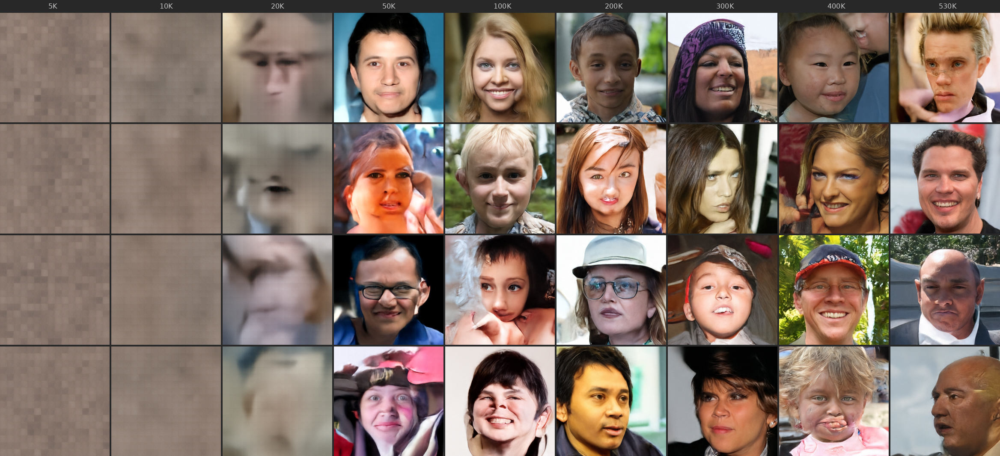

# PatchDiffusionDiT: Pixel-Space Flow Matching with DPO and Multi-Task Segmentation

**English** | [日本語](README_ja.md)

A compact 130M-parameter pixel-space Diffusion Transformer trained from scratch on 100K face images.
The project explores whether a small, domain-specific DiT can be reused across generation,
preference alignment, and dense prediction without relying on a large pre-trained text-to-image model.

The pipeline includes:
- Flow Matching pre-training in pixel space
- Diffusion-DPO adapted from DDPM noise prediction to Flow Matching velocity prediction
- DINOv2-based automated preference pair mining
- Multi-task continued pre-training for semantic segmentation with only 104 annotated masks

## Results Summary

| Component | Setting | Result |
|---|---|---|
| Face generation | 130M pixel-space DiT, 512×512 | Qualitative face synthesis from scratch |
| Pre-training | FFHQ 70K + CelebA-HQ 30K, 530K steps | ~364 img/s on RTX 6000 Ada |
| Preference alignment (DPO) | 500 human preference pairs, β=1000 | +3.4% DINO quality score, reduced artifacts |
| Segmentation | 104 annotated CelebAMask-HQ images | 78.8% pixel accuracy / 43.2% mIoU on 200 unseen images |
| Best seg classes | skin / background / nose / hair | 73.7 / 71.2 / 80.0 / 58.7 IoU |

## Key Results

### Face Generation (Flow Matching, Heun Sampler)

<p align="center">

</p>

### DPO Improves Broken Generations

Same seeds, before and after applying Diffusion-DPO with 500 human-evaluated preference pairs:

<p align="center">

</p>

### Semantic Segmentation with Only 104 Training Images

All images below are **unseen** (not in the 104-image training set):

<p align="center">

</p>

### Segmentation Quality Progression (0 / 6K / 12K / 50K steps)

<p align="center">


</p>

## Architecture

| Parameter | Value |
|-----------|-------|
| Model | PatchDiffusionDiT |
| Parameters | ~130M |
| Image size | 512 x 512 (pixel space) |
| Patch size | 32 |
| Hidden dim | 768 |
| Depth | 12 layers |
| Heads | 12 |
| Bottleneck dim | 128 |
| Position encoding | 2D RoPE |
| FFN | SwiGLU |
| Normalization | RMSNorm + AdaLN-Zero |
| Prediction type | x-prediction with v-loss |
| Sampler | Heun (2nd-order ODE) |

### Multi-Task Design

The model supports both unconditional face generation and conditional segmentation through:

- **`task_emb`**: Learned task embedding (0 = face generation, 1 = segmentation),
  added to the timestep embedding via AdaLN
- **`modality_emb`**: Learned modality embedding (0 = condition tokens, 1 = denoising target),
  added to patch tokens
- For segmentation: image tokens and noisy mask tokens are concatenated and processed
  together via self-attention (MMDiT-style), with shared 2D RoPE positions ensuring
  spatial correspondence

Both embeddings are zero-initialized for backward compatibility with pre-trained checkpoints.

## Three-Stage Pipeline

### Stage 1: Pre-Training (Flow Matching)

- **Data**: FFHQ (70K) + CelebA-HQ (30K) = 100K face images at 512x512
- **Method**: Flow Matching with Rectified Flow, v-loss, logit-normal timestep sampling
- **Patch Diffusion**: 50% probability of training on half-resolution random crops (256x256)
- **Training**: 530K steps, batch size 128, lr=1e-4, AdamW 8-bit, BF16 + torch.compile
- **Hardware**: RTX 6000 Ada 48GB (~364 img/s, ~58 min per 10K steps).
  Throughput measured with batch=128, BF16, torch.compile, 8-bit AdamW, Liger RMSNorm, RAM preload.

<p align="center">

</p>

**Generation quality over training** (5K → 530K steps, 4 samples per checkpoint):

<p align="center">

</p>

**Finding**: Loss continued to decrease after 400K steps (0.0225 → 0.0224), but
**generation quality did not visibly improve**. The model was spending compute on
imperceptible high-frequency details. This motivated DPO as a more efficient path
to quality improvement.

### Stage 2: Diffusion-DPO (Preference Alignment)

We adapted [Diffusion-DPO](https://arxiv.org/abs/2311.12908) (Wallace et al., 2023)
from DDPM noise-prediction to Flow Matching v-prediction:

**Original (DDPM)**:
```
L = -log σ(-βT(||ε_w - ε_θ||² - ||ε_w - ε_ref||²
             - (||ε_l - ε_θ||² - ||ε_l - ε_ref||²)))
```

**Ours (Flow Matching)**:
```
L = -log σ(-β(||v_w - v_θ||² - ||v_w - v_ref||²
            - (||v_l - v_θ||² - ||v_l - v_ref||²)))
```

Key differences:
- Replace noise-prediction MSE with velocity-prediction MSE
- Remove the T factor (continuous time, no discrete step count)
- Forward process: `z_t = t * x_0 + (1-t) * ε` instead of DDPM schedule

**DPO Training Details**:
- 500 human-evaluated pairwise preferences via browser-based A/B comparison UI
- β=1000, lr=1e-6, 50 epochs
- Reference model: frozen copy of the pre-trained base

**DPO Evaluation**:

| Model | DINO K-NN Score ↑ | Low-quality rate (score < 0.5) ↓ |
|-------|---:|---:|
| Base (530K) | 0.643 | 3.8% |
| + DPO (500 pairs) | 0.665 (+3.4%) | 3.4% |

DINO K-NN score is computed over 500 generated samples using DINOv2 ViT-B/14 features
with K=10. Each image is scored by its mean cosine similarity to the 10 nearest FFHQ
training features. This serves as a proxy for face-domain plausibility, not a replacement
for human preference evaluation. We also evaluate qualitatively using fixed-seed
before/after comparisons. Improvements are most visible on local facial failures such as
distorted eyes, noses, and mouths.

**Automated DPO Pipeline** (`auto_dpo.py`):

We also built a fully automated iterative DPO pipeline using DINOv2 features:
1. Generate 10K images from the current model
2. Score each image by K-NN cosine similarity to FFHQ features (DINOv2 ViT-B/14)
3. Construct 5K preference pairs (top 30% vs bottom 30%)
4. Train DPO
5. Repeat with updated model as reference

**Hyperparameter sensitivity**:

| β | lr | Result |
|------|----|--------|
| 5000 | 1e-6 | Too conservative, no visible change |
| 1000 | 1e-6 | Good balance, subtle but measurable improvement |
| 100 | 1e-6 | Collapsed (colors broken, faces distorted) |
| 5000 | 1e-7 | Stable with automated 5K pairs |

### Stage 3: Multi-Task Segmentation

Semantic segmentation is cast as a **conditional image generation task**: given a face image,
generate the corresponding RGB segmentation mask through the denoising process.

- **Data**: CelebAMask-HQ, using only **104 images** (10% of available annotations)
- **15 classes**: background, skin, nose, left/right eye, left/right brow,
  left/right ear, mouth, upper/lower lip, hair, neck
- **Training**: 50K steps, seg_ratio=0.1 (10% of steps are segmentation, 90% face generation)
- **Conditioning**: Image patches serve as condition tokens (no noise), mask patches are
  denoised. Both share the same RoPE positions for spatial alignment.

**Why 104 images can work**: The generative pre-training appears to provide a strong
face-structure prior. The segmentation stage therefore does not need to learn facial
geometry from scratch; it mainly adapts the shared representation to a color-coded
dense prediction target.

**Segmentation DPO**: We further improved segmentation quality with 2 rounds of DPO
using 100 human-evaluated mask preference pairs each.

**Quantitative Evaluation** (200 unseen images):

The 200 evaluation images are disjoint from the 104 annotated images used for training.
No segmentation masks from the evaluation split are used during training or DPO pair construction.

| Metric | Value |
|--------|-------|
| **Pixel Accuracy** | **78.8%** |
| **mIoU** | **43.2%** |

Per-class IoU:

| Class | IoU | Class | IoU |
|-------|-----|-------|-----|
| background | 71.2% | skin | 73.7% |
| nose | 80.0% | hair | 58.7% |
| l_eye | 62.0% | r_eye | 61.5% |
| l_lip | 64.7% | u_lip | 43.6% |
| neck | 37.5% | r_brow | 25.0% |
| r_ear | 18.3% | l_brow | 8.1% |
| l_ear | 0.0% | mouth | 0.0% |

Large regions (skin, hair, background, nose) perform well. Small parts (brows, ears,
mouth interior) are challenging with only 104 training images.
Full dataset (1042 images) would likely improve these significantly.

### Ablation: How Much Pre-Training is Needed for Segmentation?

We ran the same segmentation training (104 images, 50K steps) starting from different
pre-training checkpoints to investigate the relationship between generation quality
and downstream segmentation ability:

| Pre-training steps | Generation quality | Pixel Accuracy | mIoU |
|---:|---|---:|---:|
| 10K | Noisy, painting-like | 72.1% | 37.1% |
| 50K | Recognizable faces | 77.7% | 41.4% |
| 100K | Good faces | 76.1% | 41.5% |
| 200K | High quality | **79.4%** | **43.9%** |
| 300K | High quality | 73.4% | 40.6% |
| 530K | High quality (final) | 78.8% | 43.2% |

**Key findings**:
- Even at 10K steps (when generation is still broken), the model achieves 37.1% mIoU
  — structural understanding of faces is acquired very early in training.
- Segmentation performance plateaus around 50K-100K steps (41-42% mIoU),
  far before generation quality converges (~400K steps).
- The best segmentation (43.9% mIoU) comes from the 200K checkpoint,
  not the final 530K — more generation training does not necessarily improve
  downstream task performance.

This suggests that **the structural prior needed for dense prediction is acquired
much earlier than the fine-grained details needed for high-quality generation**.
This parallels findings in LLMs where downstream task ability often emerges
well before pre-training loss fully converges.

## Memorization Analysis

We verified the model generates novel faces rather than memorizing training data:

<p align="center">

</p>

Mean cosine similarity to nearest training image: 0.937 (pixel space at 256x256).
Visual inspection confirmed all generated faces are distinct individuals.

Note that pixel-space cosine similarity is not a reliable memorization metric for
aligned face datasets — frontal-facing faces with similar skin tones naturally produce
high similarity regardless of identity. We therefore rely on visual nearest-neighbor
inspection to confirm novelty.

## Limitations

- Quantitative generation evaluation (FID/KID) is not yet computed; results are primarily qualitative.
- Segmentation is limited to aligned frontal face images (CelebAMask-HQ domain).
  Generalization to arbitrary poses or non-face images is not expected.
- Small facial parts (eyebrows, ears, mouth interior) have low IoU due to the limited
  training set (104 images).
- The model is unconditional and domain-specific (faces only),
  not a general text-to-image model.
- DPO improvement is subtle at the current scale; stronger effects may require
  more preference data or larger models.

## Usage

### Requirements

```bash
pip install torch torchvision Pillow numpy tensorboard flask
# Optional: bitsandbytes (8-bit optimizer), liger-kernel (fused RMSNorm)
```

### Pre-Training

```bash
python train.py \
    --data_dir ./images256_ffhq_celebahq \
    --batch_size 128 --lr 1e-4 \
    --compile --max_autotune --optim_8bit --liger --preload \
    --bottleneck_dim 128 --img_size 512 --patch_size 32 \
    --total_steps 400000
```

### DPO Fine-Tuning

```bash
# 1. Generate images for evaluation
python generate_for_eval.py --ckpt runs/.../ckpt_final.pt --n 500

# 2. Human evaluation via web UI
python evaluate_web.py --img_dir dpo_data/generated --out dpo_data/pairs.json --n 500
# Open http://localhost:8501, click preferred image or use arrow keys

# 3. Train DPO
python train_dpo.py \
    --ckpt runs/.../ckpt_final.pt \
    --pairs dpo_data/pairs.json \
    --img_dir dpo_data/generated \
    --beta 1000 --lr 1e-6 --epochs 50
```

### Automated DPO (DINO-based)

```bash
# Precompute FFHQ features (one-time, ~10 min)
python dino_scorer.py --precompute --data_dir ./images256_ffhq_celebahq

# Run iterative auto-DPO
python auto_dpo.py \
    --base_ckpt runs/.../ckpt_final.pt \
    --n_rounds 5 --n_generate 10000 --n_pairs 5000 --beta 5000
```

### Multi-Task Segmentation

```bash
python train_multitask.py \
    --ckpt runs/.../dpo_epoch_0030.pt \
    --face_dir ./images256_ffhq_celebahq \
    --seg_dir ./celebamask_hq_15class \
    --seg_fraction 0.1 --seg_ratio 0.1 \
    --batch_size 64 --lr 1e-5 --total_steps 50000 --compile
```

### Generate Denoising Video

```bash
python make_denoise_video.py --ckpt runs/.../ckpt_final.pt --out denoise.mp4
```

## Project Structure

```
model.py                 # PatchDiffusionDiT architecture
train.py                 # Pre-training (Flow Matching + Patch Diffusion)
train_dpo.py             # Diffusion-DPO adapted for Flow Matching
train_multitask.py       # Multi-task training (face gen + segmentation)
generate_for_eval.py     # Batch image generation with fixed seeds
evaluate_web.py          # Browser-based A/B comparison UI for DPO
evaluate_seg_web.py      # Browser-based segmentation comparison UI
generate_seg_pairs.py    # Generate mask pairs for segmentation DPO
dino_scorer.py           # DINOv2-based automated image quality scoring
auto_dpo.py              # Iterative automated DPO pipeline
make_denoise_video.py    # Denoising process visualization
assets/                  # Images, graphs, and training curves
```

## Future Work

- **Scale up**: Train larger models (1B+ params) on broader datasets beyond faces
  to test whether the same three-stage pipeline (pre-training → DPO → multi-task)
  generalizes to open-domain image generation and diverse vision tasks.
- **FID/KID evaluation**: Add standard generation quality metrics for rigorous comparison.
- **More segmentation data**: Use the full CelebAMask-HQ (1042 images) and additional
  dense prediction tasks (depth estimation, edge detection) to further validate
  the "generalist vision learner" hypothesis.
- **Automated DPO at scale**: Run more iterative auto-DPO rounds with larger
  generation batches and explore reward model distillation.
- **Conditional generation**: Add text or class conditioning to move toward
  a controllable generation model.

## References

- [Flow Matching for Generative Modeling](https://arxiv.org/abs/2210.02747) (Lipman et al., 2022)
- [Scalable Diffusion Models with Transformers (DiT)](https://arxiv.org/abs/2212.09748) (Peebles & Xie, 2022)
- [Patch Diffusion](https://arxiv.org/abs/2304.12526) (Wang et al., 2023)
- [Diffusion Model Alignment Using Direct Preference Optimization](https://arxiv.org/abs/2311.12908) (Wallace et al., 2023)
- [Image Generators are Generalist Vision Learners](https://arxiv.org/abs/2604.20329) (Gabeur et al., 2026)
- [CelebAMask-HQ](https://github.com/switchablenorms/CelebAMask-HQ) (Lee et al., 2020)

## License

MIT
